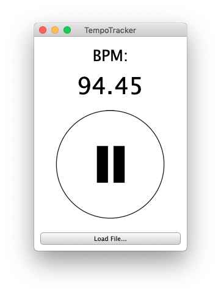

# `TempoTracker` | Realtime Tempo Extraction

This repository hold the source code for an attempt at implementing the realtime tempo tracking algorithm by Scheirer [1](#scheirer99) (with some deviations from the original algorithm). It is far from robust, but it might be useful as a starting point for those interested in an implementation of the algorithm. For details, see [the report for this  project](https://govertbrinkmann.nl/projects/api).

*The application running on macOS*:

## Compilation Instructions
The application is implemented using the [JUCE](https://juce.com) framework (v4.1), such that multiple operating systems can be targeted. I've only tested the application on macOS. Compilation on the different operating systems is as follows:

* **macOS**:
The `Builds/MacOSX` folder contains an Xcode project that can be used to compile the application.
* **Linux**: The `Builds/LinuxMakefile` folder contains a Makefile that can be used to compile the application. `cd` into this directory and run `make` to compile.
* **Windows**: The `Builds/VisualStudio2015` folder contains a VisualStudio solution that can be used for compilation.
* **Other**: Additional build targets can be configured by opening the `TempoTracker.jucer` file using the *Projucer* application provided by JUCE.

## References
<a name="scheirer99">1</a> E. Scheirer, ["Tempo and Beat Analysis of Acoustic Musical Signals"](https://www.researchgate.net/publication/13790887_Tempo_and_beat_analysis_of_acoustic_music), The Journal of the Acoustical Society of America, vol. 103, no. 1, pp. 588–601, 1999.